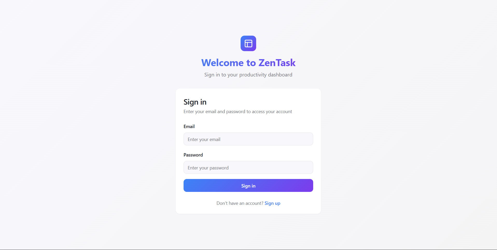
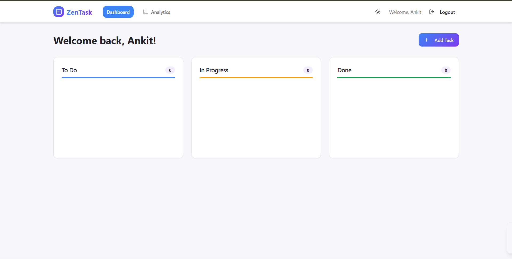
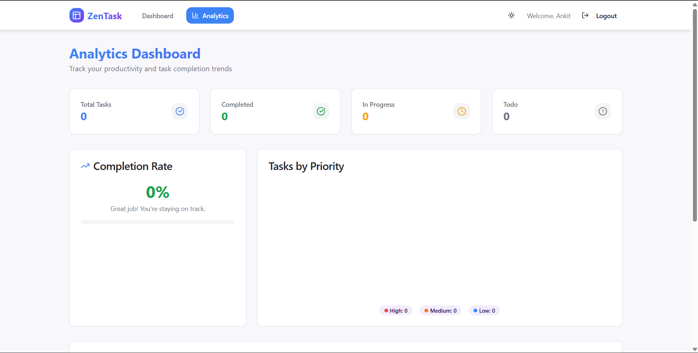

# ✅ ZenTask – Productivity Dashboard

ZenTask is a **modern full-stack task management application** that helps users organize their work with **drag-and-drop boards, analytics, and a clean UI**.  
Built with **React (Vite)**, **Node.js + Express**, and **Prisma ORM**, it’s designed to showcase strong **Full-Stack Development skills**.

---

## ✨ Features

- 🔐 **Authentication** – Register, Login, Logout with JWT  
- 📋 **Task Management (CRUD)** – Create, Read, Update, Delete tasks  
- 🎯 **Drag & Drop Board** – Move tasks between **To Do, In Progress, Done**  
- ⚡ **Realtime Reordering** – Smooth task movement across columns  
- 📊 **Analytics Dashboard** – Completion rate, tasks by priority, weekly progress  
- 🎨 **Modern UI** – Responsive design with gradient styling  
- 🚀 **Full-Stack** – React frontend + Express/Prisma backend  

---

## 🛠 Tech Stack

**Frontend:**
- React + Vite  
- TypeScript  
- TailwindCSS + shadcn/ui  
- Axios (API calls)  
- dnd-kit (drag & drop)  

**Backend:**
- Node.js + Express  
- Prisma ORM  
- PostgreSQL / MySQL (via Prisma)  
- JWT Authentication  

**Other:**
- Vercel (Frontend deployment)  
- Render (Backend deployment)  

---

## 📸 Screenshots

### 🔐 Login Page


### 📋 Task Board


### 📊 Analytics


---

## ⚙️ Installation & Setup

### 1️⃣ Clone the repository
```bash
git clone https://github.com/your-username/zentask.git
cd zentask
```
### 2️⃣ Backend Setup
```bash
cd zentask-server
npm install
```

Create a .env file in zentask-server/:
```bash
DATABASE_URL="your_database_url_here"
JWT_SECRET="your_secret_key"
```

Run migrations:
```bash
npx prisma migrate dev
```

Start backend:
```bash
npm start
```

### 3️⃣ Frontend Setup
```bash
cd zentask-client
npm install
npm run dev
```
---

## 🚀 Deployment

Backend: Deployed on Render
https://zentask-api-a6mt.onrender.com

Frontend: Deployed on Vercel
https://zentask-client.vercel.app/

Update baseURL in zentask-client/src/lib/api.ts with your deployed backend URL.

---

## 📊 Analytics Features

✅ Completion Rate → % of tasks completed

✅ Tasks by Priority → Pie chart (High, Medium, Low)

✅ Weekly Progress → Line chart of created vs completed tasks

---

## 👨‍💻 Author

Ankit Gupta
📧 Email: ankit.g.work@gmail.com
📱 Phone: +91-7728005903

⭐ If you like this project, give it a star on GitHub!